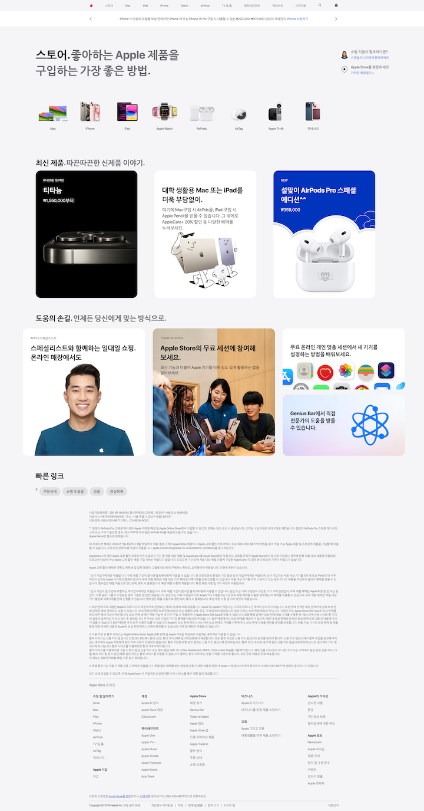

다른 직종에서의 일을 그만두고,다시 FE개발 공부를 시작했다.
학부시절 개발 프로젝트 중 프로젝트 진행, 배포 후 운영을 통해 겪은 어려움들은 기억이 나지만,
HTML, CSS 작성을 포함하여 개발 역량을 많이 잃은 것 같아서 클론코딩을 통해 기본적인 레이아웃을 짜는 연습을 해보려고 한다.
간단한 홈페이지 클론코딩이지만, 앞으로 꾸준히 개선시켜서 나중에는 내 블로그 홈페이지도 직접 개발해서 사용하고싶다 :)

### ✔ 선정한 사이트와 사이트 선정이유? 
#### [애플 스토어](https://www.apple.com/kr/store)

 

1. 복잡한 애니메이션 없이 깔끔한 UI를 갖고있어 Header/Body/Footer구조 연습하기 좋아보인다.
1. Navigation Bar 구현을 통해 hover와 같은 이벤트 핸들링 요소가 있다.
1. slide기능을 구현하기 위해 간단한 javascript 작성이 필요하다.

### ✔ 구현 페이지
#### [상화의 애플스토어 클론](https://sanghwa-first-clone.netlify.app/)

 

### ✔ 작업기간

작업기간 : 2024. 02. 23.(금) ~ 2024. 02. 24.(토)

### ✔ 아쉬운 점
1. 시멘틱한 태그 사용을 하지 않아서, HTML 구조를 한눈에 파악하기가 어려웠다. Section 태그를 잘 활용하면 좋을 것 같다..
1. css variable 활용을 했으면 훨씬 더 빠르게 작업했을 것 같다. 반복적으로 폰트의 색상을 입력하는 부분이 있는데, 매번 색상코드를 입력하다보니 시간이 오래걸렸는데, 다음부터는 css variable을 활용하면 좋을 것 같다.
1. navigation bar를 hover하였을때 나오는 애니메이션 효과를 잘 적용하지 못했다.
1. 본래 사이트에서는 신제품 리스트를 슬라이드하는 기능이 있는데, SwiperJS를 활용하여 구현했으나, 유사도가 많이 떨어진다. SwiperJS말고 기본 CSS로 구현할 수 있는지 확인해봐야할 것 같다.
1. 너무 짧은 기간동안 결과물을 만드려고 하다보니 코드에 중복되는 부분을 잘 정리하지 못한 것 같다. 리팩토링을 하는 과정을 통해 코드를 깔끔하게 작성해봐야겠다.

### ✔ 느낀점, 개선할 부분

1. 시멘틱 태그를 굳이 사용해야하나..? 클래스를 잘 나누면 보기 쉽지 않나..? 라고 막연하게 생각했는데, 혼자서 작업을 함에도 불구하고 구조를 한눈에 보기가 어렵다는 것을 깨달았다.. 역시 쓰라고 하는데는 이유가 있다.
1. 코드의 길이가 매우 길기 때문에 주석처리를 통해 알아보기 쉬운 코드를 작성해야할 것 같다. 단순한 수정을 위해 해당 코드의 위치를 찾는데 시간이 너무 오래걸렸다.